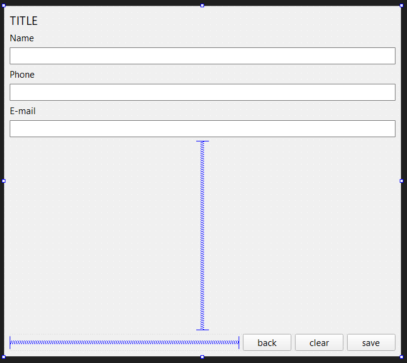

# Contacts
Este projeto é de uma aplicação desktop de agenda telefônica, construída utilizando C++ e a biblioteca [Qt](https://doc.qt.io/qt-6/index.html).

> Este documento não possui uma descrição técnica detalhada do projeto, apenas o apresentando e descrevendo a lógica geral e seu propósito.

# Tópicos

# Descrição
A fim de explorar os recursos da linguagem C++ e utilizar conceitos mais amplos, como o uso de bibliotecas dinâmicas, a aplicação foi divida em três partes:
- [Aplicação Gráfica](#aplicação-gráfica)
- [Aplicação de Console](#aplicação-de-console)
- [DLL](#dll)

# Aplicação Gráfica
A aplicação gráfica foi construída utilizando Qt Widgets em conjunto com a arquitetura MVC.

## Fluxo da Aplicação
A aplicação inicializa em uma tela simples de texto enquanto a [DLL](#dll) é inicializada, após isso, a aplicação é alterada para a tela principal de contatos, [Contacts List](#contacts-list). Este  menu possui todos os contatos cadastrados, permitindo a edição, remoção ou criação de contatos, selecionando uma ou mais das opções disponíveis.

Ao selecionar uma ou mais opções, os botões de edição, desseleção, detalhes e remoção serão exibidos, conforme [Single Selection](#contacts-list---single-selection) e [Multiple Selection](#contacts-list---multiple-selection).

Além da tela principal, também foi construída uma tela secundária para a [manipulação dos contatos](#manipulador-de-contatos), a qual se adapta de acordo com o modo de manipulação desejado, conforme exemplificado em [Delete](#contacts-list---delete), [Contact Detail](#contact-detail) e [Contact Edit](#contact-edit).

## Interfaces
### Contacts List

### Contacts List - Single Selection

### Contacts List - Multiple Selection

### Contacts List - Delete

### Contact Detail

### Contact Edit

### Manipulador de Contatos

# Aplicação de Console
A versão de console foi construída apenas para fins de testes da [DLL](#dll), não possuindo uma interação direta via terminal, sendo possível manipurar as informações apenas via código.

# DLL
A DLL principal foi construída com o Visual Studio, seguindo o padrão de seu compilador, MSVC. Nela, estão contídas as funcionalidades de manipulação e consumo da base de dados, que é um arquivo simples `.csv` que segue a ordem `ID`, `NAME`, `PHONE`, `EMAIL`. Por se tratar de um projeto de pequeno porte e a fim de otimizar o código e não incluir outras extensões, o código manipula o arquivo diretamente, o qual não realiza tratamentos e está suscetível a erros, caso o arquivo seja manipulado diretamente.